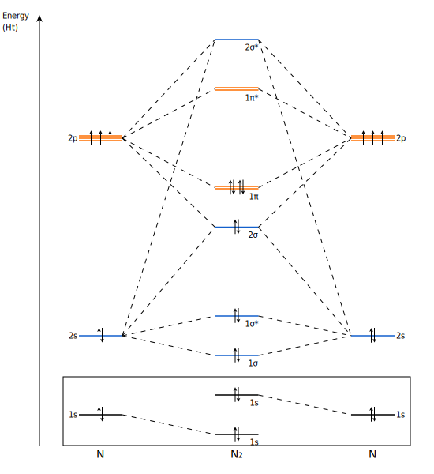

.. _examples:
.. index:: Examples

Examples
########

On this page a series of typical usage scenarios are given, including the result and scripts to reproduce them.

Qualitative MO diagram
======================

One can easily make their own MO diagram without the need of doing electronic structure calculations.
The only thing needed are the relative MO energies, MO coefficients, the atoms involved, and some basic settings.
Below an example is shown that makes a qualitative MO diagram for N2.

N2 diagram
__________

.. code-block:: python

    from pymodia import MoDia, MoDiaData, MoDiaMolecule, MoDiaFragment, subscript
    import os

    # MO data
    orbe = [-15.1, -14.9, -1.2, -0.8, 0.1, 0.5, 0.5, 1.5, 1.5, 2]
    orbc = [[1, 0, 0, 0, 0, 0, 0, 0, 0, 0],
            [0, 0, 1, 1, 1, 0, 0, 0, 0, 1],
            [0, 0, 0, 0, 1, 1, 1, 1, 1, 1],
            [0, 0, 0, 0, 1, 1, 1, 1, 1, 1],
            [0, 0, 0, 0, 1, 1, 1, 1, 1, 1],
            [0, 1, 0, 0, 0, 0, 0, 0, 0, 0],
            [0, 0, 1, 1, 1, 0, 0, 0, 0, 1],
            [0, 0, 0, 0, 1, 1, 1, 1, 1, 1],
            [0, 0, 0, 0, 1, 1, 1, 1, 1, 1],
            [0, 0, 0, 0, 1, 1, 1, 1, 1, 1]]
    ao_e = [-15, -1, 1, 1, 1]

    # Setting up PyMoDia objects
    mol_name = subscript("N2")
    mol = MoDiaMolecule(mol_name, orbe, orbc, 14)
    n1 = MoDiaFragment('N', ao_e, 7, {i:i for i in range(5)})
    n2 = MoDiaFragment('N', ao_e, 7, {i+5:i for i in range(5)})
    data = MoDiaData(mol, n1, n2)

    mo_colors = ["#000000", "#000000", "#1260CC", "#1260CC", "#1260CC",
                "#FE6E00", "#FE6E00", "#FE6E00", "#FE6E00", "#1260CC",
                "#1260CC"]
    ao_colors = ["#000000", "#1260CC", "#FE6E00", "#FE6E00", "#FE6E00"]
    mo_labels = ['1s', '1s', '1σ', '1σ*', '2σ', '1π', '1π', '1π*', '1π*', '2σ*']

    diagram = MoDia(data, orbc_cutoff=0.9, mo_color=mo_colors, ao1_color=ao_colors,
                    ao2_color=ao_colors, draw_energy_labels=False,
                    mo_labels=mo_labels, draw_level_labels=True,
                    level_labels_style='mo_ao')

    # Save image
    diagram.export_svg(os.path.join(os.path.dirname(__file__), "mo_n2_qualitative.svg"))

Quantitative MO diagram
=======================

By making use of electronic structure calculation packages like `PyQInt
<https://github.com/ifilot/pyqint>`_ a more realistic MO diagrams can be made.
Some rounding might be necessary to make sure degenerate levels have the (exact)
same energy. Below an example is shown which produces an quantitative MO diagram
of H2.

.. code-block:: python

    import os
    from pymodia import MoDia, MoDiaData, autobuild_from_pyqint, MoDiaSettings
    from pyqint import MoleculeBuilder, HF, FosterBoys

    # Perform PyQInt calculations for CO and its localization
    mol = MoleculeBuilder().from_name('co')
    res = HF().rhf(mol, 'sto3g')

    # adjust settings
    settings = MoDiaSettings()
    settings.orbc_color = '#555555'
    settings.arrow_color = '#CC0000'

    # attempt to automatically create mol and fragments from calculation
    mol, f1, f2 = autobuild_from_pyqint(res, name='co')

    # we make here a small adjustment to the height of the 5σ orbital to avoid
    # overlap with the 2x2π MO
    moe = res['orbe']
    moe[6] += 0.1

    # build data object
    data = MoDiaData(mol, f1, f2)
    data.set_moe(moe)

    diagram = MoDia(data, draw_level_labels=True, level_labels_style='mo_ao',
                    mo_labels=['1σ', '2σ', '3σ', '4σ', '1π', '1π', '5σ', '2π', '2π', '6σ'],
                    settings=settings)
    diagram.export_svg(os.path.join(os.path.dirname(__file__), "mo_co_canonical.svg"))

.. figure:: _static/img/mo_co_canonical.svg
   :align: center
   :width: 600
   :alt: qualitative molecular orbital diagram of N2