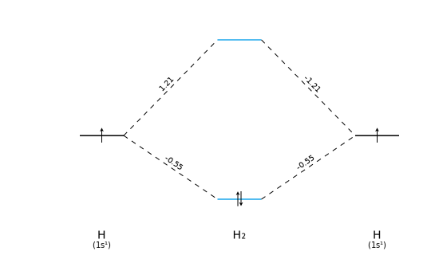

.. _examples:
.. index:: Examples

Examples
########

On this page a series of typical usage scenarios are given, including the result and scripts to reproduce them.

Qualitative MO diagram
======================

One can easily make their own MO diagram without the need of doing electronic structure calculations.
The only thing needed are the relative MO energies, MO coefficients, the atoms involved, and some basic settings.
Below an example is shown that makes a qualitative MO diagram for N2.

N2 diagram
__________

.. code-block:: python

    from pymodia import PyMoDia, Atom, Molecule, subscript
	
    # Molecular orbital energy levels
    mo_energies = [-15.1, -14.9, -1.2, -0.8, 0.1, 0.5, 0.5, 1.5, 1.5, 2]

    # Orbital coefficients
    # arranged like column vectors, each column is one MO
    orbc = [[1, 0, 0, 0, 0, 0, 0, 0, 0, 0],
            [0, 0, 1, 1, 1, 0, 0, 0, 0, 1],
            [0, 0, 0, 0, 1, 1, 1, 1, 1, 1],
            [0, 0, 0, 0, 1, 1, 1, 1, 1, 1],
            [0, 0, 0, 0, 1, 1, 1, 1, 1, 1],
            [0, 1, 0, 0, 0, 0, 0, 0, 0, 0],
            [0, 0, 1, 1, 1, 0, 0, 0, 0, 1],
            [0, 0, 0, 0, 1, 1, 1, 1, 1, 1],
            [0, 0, 0, 0, 1, 1, 1, 1, 1, 1],
            [0, 0, 0, 0, 1, 1, 1, 1, 1, 1]]

    # Setting up Atom and Molecule objects
    N = Atom("N", [-15, -1, 1, 1, 1])
    Mol_name = subscript("N2")
    N2 = Molecule(Mol_name, N, 1, N, 1)

    # Some settings for the diagram
    core_cutoff = -10
    contribution_cutoff = 0.9

    mo_colors = ["#000000", "#000000", "#1260CC", "#1260CC", "#1260CC",
                 "#FE6E00", "#FE6E00", "#FE6E00", "#FE6E00", "#1260CC", "#1260CC"]
    ao_colors = ["#000000", "#1260CC", "#FE6E00", "#FE6E00", "#FE6E00"]

    # Making diagram
    diagram = PyMoDia(N2, mo_energies, orbc, core_cutoff)
    diagram.draw_levels(colors_mo=mo_colors,
                        colors_ao1=ao_colors, colors_ao2=ao_colors)
    diagram.draw_occupancies()
    diagram.draw_contributions(contribution_cutoff)
	
    # Save image
    diagram.image.save_svg("MO_diagram_N2.svg")

.. figure:: _static/img/MO_diagram_N2.svg
   :align: center
   :width: 600
   :alt: qualitative molecular orbital diagram of N2

|

Quantitative MO diagram
=======================

By making use of electronic structure calculation packages like `PyQInt <https://github.com/ifilot/pyqint>`_ a more realistic MO diagrams can be made.
Some rounding might be necessary to make sure degenerate levels have the (exact) same energy.
Below an example is shown which produces an quantitative MO diagram of H2.

H2 diagram
__________

.. code-block:: python

    from pymodia import PyMoDia, Atom, Molecule, subscript
    import pyqint
    import numpy as np
	
    # PyQInt calculations
    pyqint_molecule = pyqint.Molecule()
    pyqint_molecule.add_atom('H', 0.00, 0.00, 0.00, unit='angstrom')
    pyqint_molecule.add_atom('H', 0.00, 0.74, 0.00, unit='angstrom')
    pyqint_result = pyqint.HF().rhf(pyqint_molecule, 'sto3g')
	
    # Rounding PyQInt results for PyMoDia
    orbc = np.round(pyqint_result['orbc'], 3)

    # Setting up PyMoDia objects
    H = Atom("H", [-0.08])
    Mol_name = subscript("H2")
    Mol = Molecule(Mol_name, H, 1, H, 1)
	
    # Setting for the diagram
    core_cutoff = -10
    contribution_cutoff = 0.3

    # Change canvas dimensions
    outer_height = 200
    core_height = 20
    height = outer_height+core_height+100

    # Colors for MOs
    mo_colors = ["#1aa7ec", "#1aa7ec"]
	
    # Making diagram
    diagram = PyMoDia(Mol, mo_energies, orbc, outer_height=outer_height,
                      core_height=core_height, height=height,
                      core_cutoff=core_cutoff)
    diagram.draw_levels(colors_mo=mo_colors)
    diagram.draw_occupancies()
    diagram.draw_contributions(contribution_cutoff, print_coeff=True)
	
    # Save image
    diagram.image.save_svg("MO_diagram_H2.svg")
   

|

Customizability
===============

There is a wide range of colors lengths and sizes that can be changed some examples are shown below.
The first example below shows how one could make a 'dark mode' MO diagram.

Dark mode CH4 diagram
_____________________

.. code-block:: python

    from pymodia import PyMoDia, Atom, Molecule, subscript
    import pyqint
    import numpy as np
	
    # PyQInt calculations
    pyqint_molecule = pyqint.Molecule()
    pyqint_molecule.add_atom('C', 0.00, 0.00, 0.00, unit='angstrom')
    pyqint_molecule.add_atom('H', 0.64, -0.64, -0.64, unit='angstrom')
    pyqint_molecule.add_atom('H', -0.64, 0.64, -0.64, unit='angstrom')
    pyqint_molecule.add_atom('H', 0.64, 0.64, 0.64, unit='angstrom')
    pyqint_molecule.add_atom('H', -0.64, -0.64, 0.64, unit='angstrom')
    pyqint_result = pyqint.HF().rhf(pyqint_molecule, 'sto3g')
	
    # Rounding PyQInt results for PyMoDia
    mo_energies = np.round(pyqint_result['orbe'], 3)
    orbc = np.round(pyqint_result['orbc'], 3)

    # Keeping original energy levels for energy bar
    energies = mo_energies.copy()

    # Increase distance of 1pi* and 2sigma for readability diagram
    mo_energies[5] = 0.1
    mo_energies[6] = mo_energies[5]
    mo_energies[7] = mo_energies[5]

    # Setting up PyMoDia objects
    C = Atom("C")
    H = Atom("H")
    Mol_name = subscript("CH4")
    CH4 = Molecule(Mol_name, C, 1, H, 4)

    # Making diagram
    diagram = PyMoDia(CH4, mo_energies, orbc, level_width=70,
                      main_color='#e3e3e3', background_color='#121212')
    diagram.draw_levels(colors_mo=['#BB86FC'], colors_ao1=['#BB86FC'],
                        colors_ao2=['#BB86FC'])
    diagram.draw_occupancies(color='#FE6100')
    diagram.draw_contributions(abs_cutoff=0.3, print_coeff=True,
                               color='#31E28B')
    diagram.draw_energy_scale(labels=energies)
    diagram.draw_labels(['1a1', '2a1', '1t2', '1t2', '1t2',
                         '2t2', '2t2', '2t2', '3a1'], 'mo_ao')
	
    # Save image
    diagram.image.save_svg("mo_diagram_ch4.svg")
   
.. figure:: _static/img/MO_diagram_CH4.svg
   :align: center
   :width: 600
   :alt: Quantitative molecular orbital diagram of CH4 in dark mode color scheme

|